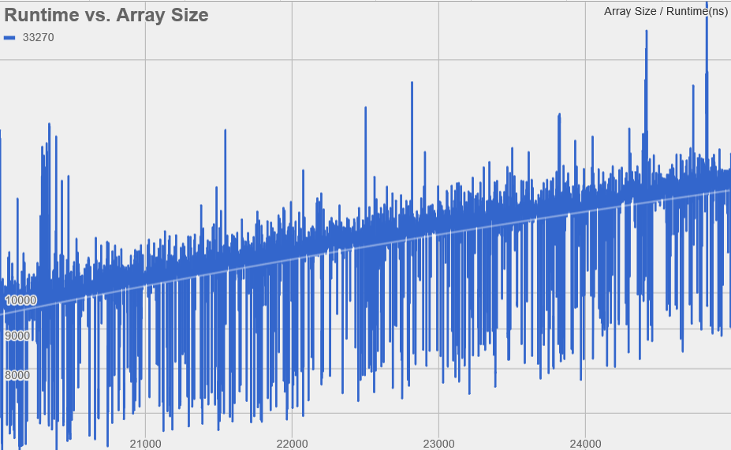

# baconEggNCheese
Aaron Li
 
Jackie Li
 
George Liang
### Hypothesis
We hypothesize that the worst case scenario for QuickSort would be choosing a pivot that is the upper or lower extreme element, which leads to the length of one side of the partition being 0. That means that successive calls
leads to more length 0 parts, which doesn't utilize the power of partitioning in QuickSort leading to O(n^2) runtime. 
The best case scenario for QuickSort would be choosing a pivot that is always the median element. Choosing an element that
is always the median would lead to the greatest division of work and least calls to qsort which would result in O(n) runtime,
as you will iterate n times for the array to be sorted. However, best case cannot always be guaranteed on scrambled arrays. The average runtime for QuickSort would be O(nlogn) as it needs to be faster than O(n^2) but slower than O(n).

### Background
Our inspiration came from the splitting of work observed in MergeSort. We included a split with the pivot being the center of 
the array in order to have a lower bound split and an upper bound split, and the median as the sorted int. This way we can 
sort an array with the least calls to QuickSort.

### Experiment Methodology
First we randomly generate 20,000 arrays that will be sorted by QuickSort. QuickSort is called on each of the array, size of 28k elements plus, and the runtime of each call is saved to our csv file. With the data from the runtimes of QuickSort on each on each array, we graphed the results and added a line of best fit.

### Results
-Spreadsheets w/Graph:
https://docs.google.com/spreadsheets/d/16idPKsyhuhsMqSbJXmsax1LFsTU0YChnYocJlhcwMkQ/edit?usp=sharing

### Data Analysis
Based on close observation of our graph, we see that the line of best fit is significantly below the actual concentration of data points. We can deduce that there is curvature to our data suggesting an O(nlogn) runtime for average data sets. 
